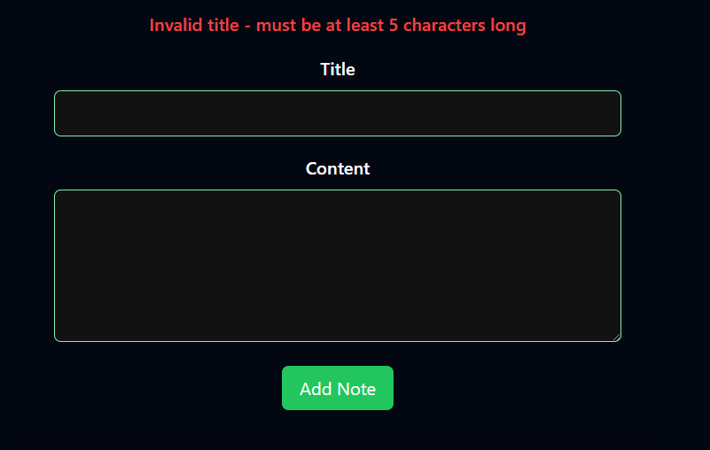

Abans de continuar, `useNavigation` només ho podràs fer servir en formularis que tinguin un `action` definit. Això és perquè `useNavigation` necessita saber quan el formulari ha estat enviat per poder redirigir l'usuari a la pàgina corresponent. I d'altra banda només serà compatible amb `Form` de Remix, ja que `useNavigation` està dissenyat per aprofitar les funcionalitats de `Form` com `isSubmitting` i `isValidating`.

Anem a veure més coses que podem fer amb `Form` i les accions. Una de les coses més comunes que es fa en un formulari és validar les dades abans d'enviar-les al servidor. Això és important per assegurar que les dades siguin correctes i que no hi hagi cap problema en el servidor.


### Validació al `action` i gestió d'errors amb Remix

Un dels punts forts de Remix és la seva gestió nativa de formularis amb `action` i la capacitat de validar dades al servidor. Vegem com es pot implementar un flux bàsic que valida el contingut enviat pel formulari i mostra errors si cal.

#### **Validació al `action`**
Quan un usuari envia un formulari amb Remix, l'objecte `action` rep les dades del formulari. Podem validar aquestes dades al servidor i retornar un missatge d'error si no compleixen els criteris establerts.

```tsx
export const action = async ({ request }: ActionFunctionArgs) => {
  const formData = await request.formData();

  const noteData: Note = {
    id: new Date().toISOString(),
    title: formData.get("title") as string,
    content: formData.get("content") as string,
  };

  // Validació del títol
  if (!noteData.title || noteData.title.trim().length < 5) {
    return json(
      { error: "Invalid title - must be at least 5 characters long" },
      { status: 400 }
    );
  }

  // ... resta del codi per desar les notes al fitxer
};
```

- Aquí es valida que el camp `title` no sigui buit i tingui almenys 5 caràcters.
- Si no es compleix la condició, es retorna un objecte JSON amb l'error i un codi d'estat `400`.
- A Response.json, el primer argument és l'objecte JSON que es retornarà al client, i el segon és un objecte d'opcions que permet configurar detalls com el codi d'estat de la resposta (status). Això assegura que el servidor retorni dades estructurades i gestionables per al client, per exemple, indicant errors (status: 400) o èxits (status: 200).

---

#### **Recuperació d'errors al client amb `useActionData`**

Per mostrar errors al client, es fa servir el hook `useActionData`. Aquest hook permet accedir a la resposta retornada pel `action` després d'una petició de tipus POST, PUT o DELETE.

Una cosa que no havíem vist fins ara MOLT IMPORTANT. `useActionData` (així com també `useLoaderData`) **no s'han de cridar necessàriament des del "route component"**, notes.tsx en aquest cas. Aquests hooks poden ser cridats des de qualsevol component que es renderitzi després de l'acció, com per exemple el component `NewNote` que és renderitzat després de l'acció de creació de la nota.

Modifiquem el component `NewNote` per capturar i mostrar l'error:

```tsx
import { Form, useActionData } from "@remix-run/react";

// ...

function NewNote(): JSX.Element {
  const actionData = useActionData<{ error?: string }>();

  return (
    <Form
      method="post"
      id="note-form"
      className="max-w-xl my-12 mx-auto p-8 rounded-lg bg-primary-100 shadow-md text-center"
    >
      {/* Mostra l'error retornat pel servidor de manera condicional */}
      {actionData?.error && (
        <p className="text-red-500 font-semibold mb-4">{actionData.error}</p>
      )}

      {/* Camps del formulari */}
      <p className="mb-4">
        <label htmlFor="title" className="block text-white font-semibold mb-2">
          Title
        </label>
        <input
          type="text"
          id="title"
          name="title"
          required
          className="w-full p-2 border border-green-300 rounded-md"
        />
      </p>
      // ...
    </Form>
  );
}

export default NewNote;
```

---

### Flux complet:
1. **Formulari amb `Form`:**
   - Envia les dades al `action` associat.
   - Si hi ha errors al `action`, els podem capturar i mostrar amb `useActionData`.

2. **Validació al `action`:**
   - Comprova si les dades compleixen els criteris establerts.
   - Si hi ha errors, retorna un objecte JSON amb el missatge i un codi d'estat.

3. **Gestió al client:**
   - Amb `useActionData`, recuperem el missatge d'error i l'inserim dinàmicament al formulari.

---

Hauríeu de poder veure el vostre formulari com en la imatge de sota. Si introduïu un títol amb menys de 5 caràcters i intenteu enviar el formulari, hauríeu de veure un missatge d'error com el de la imatge.

