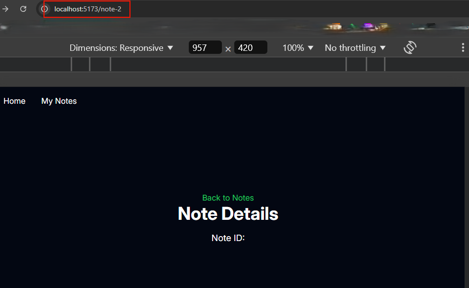

### **Introducció a les Rutes Dinàmiques i les Rutes Punt-delimitades a Remix**

Remix té un sistema de rutes basat en noms d'arxius que facilita la definició d'URL i estructura de navegació de la teva aplicació. Quan necessites treballar amb **paràmetres dinàmics** o **subrutes** més complexes, Remix introdueix dues eines potents:

1. **Rutes Dinàmiques (`$param`):**  
   Aquestes rutes permeten capturar parts variables de l'URL. Per exemple, si tens diferents productes amb ID únics, pots utilitzar rutes dinàmiques per renderitzar una pàgina específica per a cada producte.

   Exemple:  
   - Arxiu: `app/routes/product.$id.tsx`
   - URL: `/product/123`  
   Això capturarà el valor `123` i el passarà com a paràmetre `id` al loader o al component.

2. **Rutes Punt-delimitades (`.`):**  
   Aquestes rutes s'utilitzen per definir subrutes relacionades dins d'una mateixa jerarquia. Això és útil per mantenir l'estructura del codi clara i reutilitzar components o dades.

   Exemple:  
   - Arxiu: `app/routes/product.$id.edit.tsx`
   - URL: `/product/123/edit`  
   Aquesta estructura permet afegir funcionalitats, com editar un producte, mantenint una jerarquia clara.

---

### **Quan Utilitzar Rutes Dinàmiques?**
Les rutes dinàmiques són útils per:
- Pàgines d'informació específica (productes, usuaris, articles).
- Gestió de paràmetres variables a l'URL (id, slug, categories).

---

### **Quan Utilitzar Rutes Punt-delimitades?**
Les rutes punt-delimitades són útils per:
- Crear accions o subfuncionalitats associades a una entitat principal (edit, delete, details).
- Mantenir una estructura clara dins de la carpeta `routes`.

---

### Amb les notes

Anem a tractar de mostrar les notes amb tota la seva informació en una sola pàgina. Per això, crearem una ruta dinàmica que capturi l'ID de la nota i la renderitzi amb tota la seva informació.

Primer generem el nou arxiu de ruta dinàmica `app/routes/$noteId.tsx`. Amb aquesta signe de `$` indiquem que és una ruta dinàmica i capturarem el valor de `noteId` com a paràmetre i no com a nom d'arxiu.

De moment crea el nou component de ruta dinàmica amb el següent codi:

```tsx
// app/routes/$noteId.tsx
export default function NoteDetailsPage() {
  return (
    <div className="flex flex-col items-center justify-center min-h-screen">
      <nav>
        <a href="/notes" className="text-green-500 hover:underline">
          Back to Notes
        </a>
      </nav>
      <h1 className="text-4xl font-bold mb-4">Note Details</h1>
      <p className="text-lg">Note ID: </p>
    </div>
  );
}
```

Si ara intentes accedir a qualssevol ruta note-ID, per exemple `/note-1` o `note1` o `noteelquesigui`, veuràs la pàgina de detalls de la nota amb l'ID `1`, com pots veure a la següent imatge:



Abans de mostrar la informació de la nota, anem també a fer que a la nostra llista, l'element sigui un enllaç que ens porti a la pàgina de detalls de la nota. Per això, modifica el component `NoteListPage` amb el hook `Link` embolcallem tot l'element `li` i afegim la propietat `to` amb la ruta dinàmica `$noteId`. A Remix, si fem servir `Link` amb un valor `to` sense la barra ("slash") inicial, aquesta s'afegeix a la ruta actual.


```tsx
// app/routes/notes.tsx
import { Link } from "remix";

...
      <Link to={note.id}>
      <article>
      ...
      </article>
      </Link>

```

Això farà que intenti accedir per exemple a `http://localhost:5173/notes/2024-12-01T14:43:54.217Z`. Fixeu-vos que afegirà la ruta actual `notes` a la ruta dinàmica `2024-12-01T14:43:54.217Z`. Això és perquè la ruta dinàmica no comença amb una barra (`/`), per tant, s'afegeix a la ruta actual.

Per evitar-ho podem modificar el nostre arxiu de rutes dinàmiques per afegir un camp al path `note`. Modifiquem el nom del nostre arxiu amb `note.$noteId.tsx`.

Ara passarà quelcom en el cas de V2 de Remix. Si intentem accedir ara a la ruta dinàmica, com que el nom del component de ruta és `notes.tsx`, aquest s'imposa a qualsevol ruta dinàmica que comenci amb `notes`. Per tant, si intentem accedir a `http://localhost:5173/notes/2024-12-01T14:43:54.217Z`, veurem la pàgina de llistat de notes i no la pàgina de detalls de la nota. Simplement haurem també de modificar aquest arxiu per `notes._index.tsx`. Així aquest només es carregarà quan cridem a `http://localhost:5173/notes/`

#### **Carregant ("Fetching") les dades a la ruta dinàmica**

Els **paràmetres (`params`)** són una de les eines clau en Remix per capturar valors dinàmics des de les rutes. Es fan servir principalment en **loaders** per accedir a parts específiques de l'URL.

---

### **Com funciona `params` a Remix?**

1. **Definició de la ruta dinàmica:**  
  Ja hem vist que les definim amb utilitzant el símbol `$` al nom del fitxer dins de la carpeta `routes`.  
   Per exemple:
   - Fitxer: `app/routes/notes.$noteId.tsx`
   - URL: `/notes/123`
   Això permet capturar `123` com a valor de `noteId`.

2. **Accés als paràmetres amb `params`:**  
   Remix passa els valors de les rutes dinàmiques al loader a través de l'objecte `params`. Aquests es poden utilitzar per buscar dades específiques.

---

### **Explicació del Codi**

#### **Loader: Captura i processa els paràmetres**
```typescript
// app/routes/notes.$noteId.tsx
export async function loader({ params }: LoaderFunctionArgs) {
  const notes = await getStoredNotes(); // Obté totes les notes

  // Busca la nota que coincideix amb l'ID de la URL
  const selectedNote = notes.find((note) => note.id === params.noteId);

  if (selectedNote) {
    return { selectedNote }; // Retorna la nota seleccionada
  } else {
    // Llança un error si la nota no existeix
    throw Response.json("Not Found", { status: 404 });
  }
}
```
- **`params.noteId`:** Aquí accedim al valor dinàmic de la URL (`123` en aquest cas).
- Es busca dins de la llista de notes utilitzant aquest paràmetre.
- Si la nota es troba, es retorna al component mitjançant el loader.
- Si no es troba, es llança un error amb `Response.json`.

---

#### **Component: Recupera les dades i les renderitza**
```typescript
// app/routes/notes.$noteId.tsx
export default function NoteDetailsPage() {
  // Recupera les dades carregades pel loader
  const { selectedNote } = useLoaderData<{ selectedNote: Note }>();

  return (
    <div className="flex flex-col items-center justify-center min-h-screen">
      <nav>
        <a href="/notes" className="text-green-500 hover:underline">
          Back to Notes
        </a>
      </nav>
      <h1 className="text-4xl font-bold mb-4">Note Details</h1>
      <p className="text-lg">Note ID: {selectedNote.id}</p>
      <p className="text-lg">Title: {selectedNote.title}</p>
      <p className="text-lg">Content: {selectedNote.content}</p>
    </div>
  );
}
```
- **`useLoaderData`:** Recupera les dades retornades pel loader.
- Les dades de la nota seleccionada (`selectedNote`) es mostren al component.

---

### **Avantatges del Sistema de `params` a Remix**

1. **Dinàmic i eficient:**  
   Permet manejar rutes dinàmiques de forma simple i flexible.

2. **Integració amb loaders:**  
   Simplifica la càrrega de dades basades en URL sense haver d'escriure codi addicional al client.

3. **Gestió d'errors incorporada:**  
   Errors com notes inexistents es poden gestionar fàcilment amb els Error Boundaries o Catch Boundaries.

Amb aquest sistema, pots gestionar fàcilment rutes dinàmiques com `/notes/:id` o altres escenaris complexos de navegació!


### Afegim finalment una gestió d'errors específica per les rutes dinàmiques

Abans havíem acabat posant la funció d'error boundary a `notes._index.tsx`. A nivell de jerarquia de components, en realitat no tenim que la ruta dinàmica estigui "injectada" dins de la nostra pàgina d'index. Per tant si no tenim gestió d'Error Boundary al root, no hi hauria cap "handler" per aquesta pàgina.

Fem-ne un específic per les rutes dinàmiques:

```tsx
// app/routes/notes.$noteId.tsx
export function ErrorBoundary() {
  const error = useRouteError();

  // Cas 1: Error de resposta 404 (no trobat)
  // Aquest cas gestiona únicament els errors on l'element buscat no existeix (per exemple, una nota amb un id no trobat).
  if (isRouteErrorResponse(error) && error.status === 404) {
    return (
      <div className="flex flex-col items-center justify-center min-h-screen bg-red-100 text-yellow-900">
        <h1 className="text-4xl font-bold mb-4">Note not found</h1>
        <p className="text-lg mb-4">
          The note you are looking for does not exist.
        </p>
        <Link
          to="/notes"
          className="text-blue-500 underline hover:text-blue-700"
        >
          Back to the Notes
        </Link>
      </div>
    );
  }

  // Cas 2: Altres errors de resposta (500, 403, etc.)
  // Aquest cas cobreix errors del tipus `Response`, però no `404`. Mostra l'estat i un missatge personalitzat si està disponible.
  if (isRouteErrorResponse(error)) {
    return (
      <div className="flex flex-col items-center justify-center min-h-screen bg-red-100 text-red-900">
        <h1 className="text-4xl font-bold mb-4">Error!</h1>
        <p className="text-lg mb-4">
          {`There was an error with status: ${error.status}.`}
        </p>
        <p>{error.data?.message || "Something went wrong."}</p>
        <Link
          to="/notes"
          className="text-blue-500 underline hover:text-blue-700"
        >
          Back to the Notes
        </Link>
      </div>
    );
  }

  // Cas 3: Errors inesperats (no són del tipus `Response`)
  // Aquí es gestiona qualsevol error que no sigui del tipus `Response`, com errors de JavaScript.
  let errorMessage = "An unknown error occurred.";
  if (error instanceof Error) {
    errorMessage = error.message;
  }

  return (
    <div className="flex flex-col items-center justify-center min-h-screen bg-red-100 text-red-900">
      <h1 className="text-4xl font-bold mb-4">Uh oh ...</h1>
      <p className="text-lg mb-4">Something went wrong.</p>
      <pre className="bg-gray-800 text-white p-4 rounded">{errorMessage}</pre>
      <Link
        to="/notes"
        className="text-blue-500 underline hover:text-blue-700"
      >
        Back to the Notes
      </Link>
    </div>
  );
}
```

Cas 1: Errors 404 tenen un missatge personalitzat per indicar que l'element buscat no existeix.
Cas 2: Altres errors de resposta (500, 403, etc.) tenen informació més genèrica sobre el codi d'estat i el missatge proporcionat pel servidor.
Cas 3: Errors inesperats o desconeguts es manegen per assegurar que l'aplicació no es trenqui completament, mostrant un missatge genèric o l'error de JavaScript.


## **Extra - Metadata**

### **Què és la Metadata?**

La **metadata** és informació addicional que es pot afegir a les pàgines web per millorar la seva indexació i visibilitat als motors de cerca. Aquesta informació inclou títols, descripcions, paraules clau, imatges i altres dades rellevants per a la pàgina.

### **Què és la funció `meta` a Remix?**

La funció `meta` a Remix s'utilitza per definir les metadades d'una ruta, com ara el títol (`<title>`) i les etiquetes meta (`<meta>`). Això permet configurar informació important per a SEO i experiència d'usuari directament des de la ruta.

### **Com funciona?**

La funció `meta`:
- Rep com a paràmetre l'objecte retornat pel `loader` (si n'hi ha).
- Retorna un array d'objectes amb informació sobre el títol i les etiquetes meta.

### **Exemple bàsic:**
```tsx
import type { MetaFunction } from "@remix-run/node";

export const meta: MetaFunction = () => {
  return [
    { title: "My App" },
    { name: "description", content: "This is a great app!" },
  ];
};
```

### **Exemple amb dades dinàmiques:**
Podem accedir a les dades carregades pel `loader` i utilitzar-les per personalitzar les metadades.

```tsx
import type { MetaFunction } from "@remix-run/node";
import type { Note } from "~/data/notes";

export const loader = async () => {
  const note = { id: "1", title: "Note 1", content: "This is the first note" };
  return { note };
};

export const meta: MetaFunction = ({ data }: { data: { note: Note } }) => {
  if (!data || !data.note) {
    return [
      { title: "Note not found" },
      { name: "description", content: "No details available for this note." },
    ];
  }

  return [
    { title: data.note.title },
    { name: "description", content: `Details for: ${data.note.title}` },
  ];
};
```

### **On es defineix?**
- Cada fitxer de ruta pot tenir la seva pròpia funció `meta` per personalitzar el comportament segons les necessitats d'aquesta ruta.

### **Què es genera al navegador?**
En aquest exemple, el navegador veurà:
```html
<head>
  <title>Note 1</title>
  <meta name="description" content="Details for: Note 1">
</head>
```

### En el nostre codi 

Tenim per una banda `notes._index.tsx` que és la pàgina principal de les notes. Aquesta pàgina no té cap loader, per tant, no té cap dada a carregar. Però podem afegir metadades per a la pàgina principal de les notes.

Afegim únicament

```tsx
// app/routes/notes._index.tsx

export const meta: MetaFunction = () => {
  return [
    { title: "Notes App" },
    { name: "description", content: "A simple app to manage your notes." },
  ];
};
```

I en el cas de la pàgina de detalls de les notes, podem afegir metadades dinàmiques basades en la nota seleccionada.

```tsx
export const meta: MetaFunction = ({
  data,
}: {
  data: { selectedNote: Note };
}) => {
  if (!data || !data.selectedNote) {
    return [
      { title: "Note not found" },
      { name: "description", content: "No details available for this note." },
    ];
  }

  const { selectedNote } = data;

  return [
    { title: selectedNote.title },
    { name: "description", content: `Details for note: ${selectedNote.title}` },
  ];
};
```
